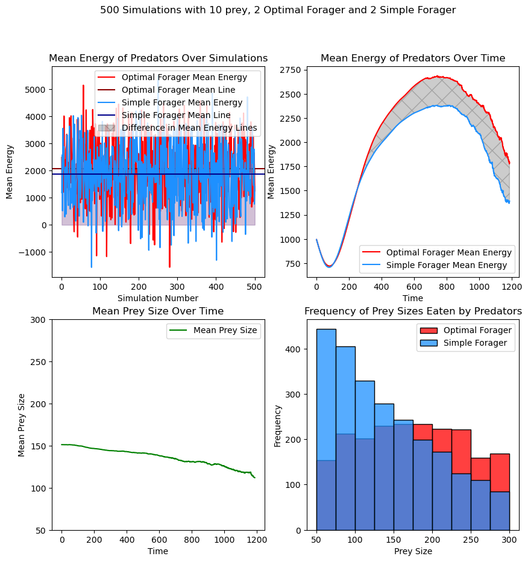
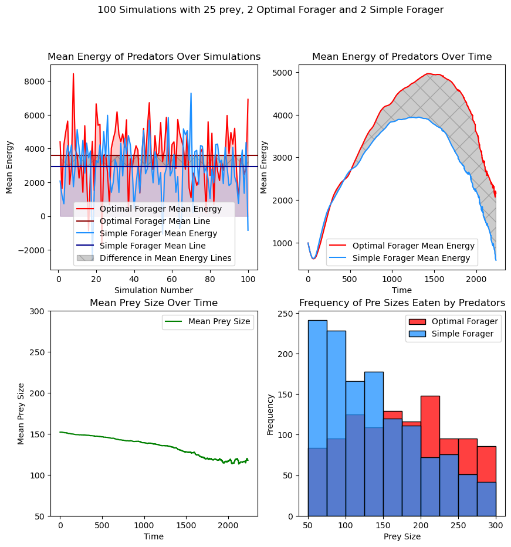
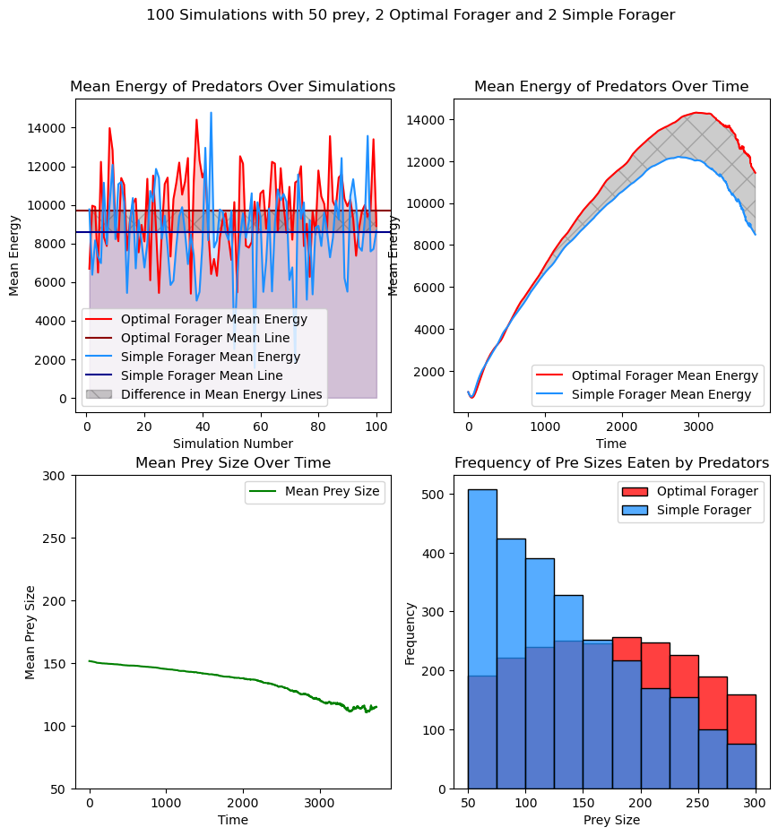
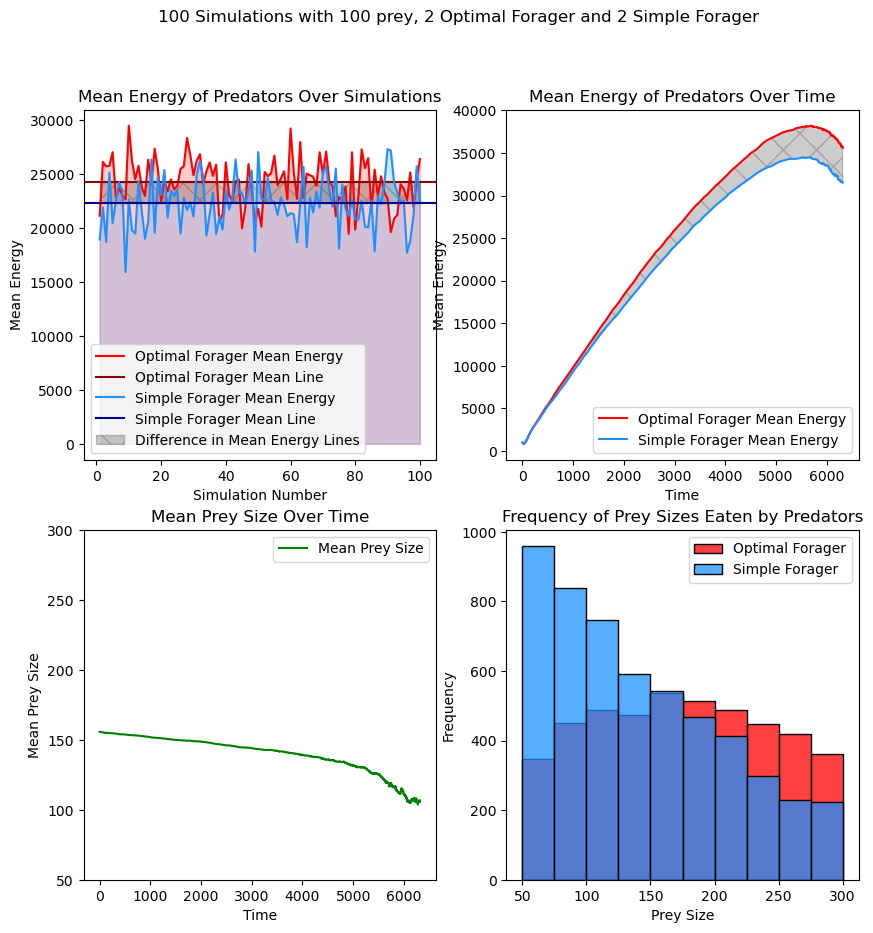
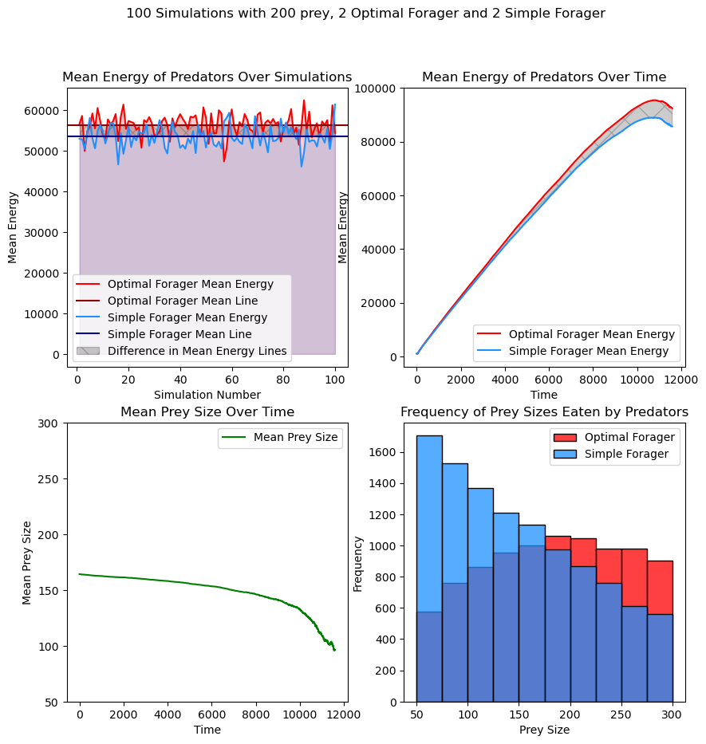
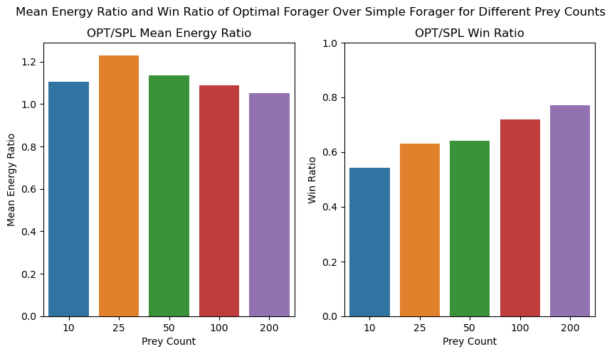

# optimal-foraging-model
 
## Introduction

To maximize their fitness, predators can adapt a foraging strategy that maximizes benefits over costs. Optimal foraging theory helps us to predict the best strategy animal adapts for achieving this goal and it predicts that economically advantageous foraging pattern will be selected over time. According to this theory, predators should decide which prey to eat based on energy gain from that prey and energy spend for handling and reaching to that prey.  For a ecosystem containing two preys in which "P1" is larger and containing more energy than "P2", the predator can decide based on benefits over costs as given:

$$
E_i / (t_{Hi} + t_{Si} ) 
$$

If:

$$
E_1 / (t_{h1} + (t_{s1}) < E_2 / (t_{h2} + (t_{s2})
$$

the predator targets smaller prey, P2.
If:

$$
E_1 / (t_{h1} + (t_{s1}) > E_2 / (t_{h2} + (t_{s2})
$$

the predator targets larger prey, P1.
## Parameters and Calculations


```python
SIZE_R = 10
SPEED = 1
PREY_COUNT = 100
PREY_MAX_SIZE = 300
PREY_MIN_SIZE = 50
PRED1_COUNT = 2
PRED2_COUNT = 2
MOVEMENT = 5
STARTING_ENERGY = 1000
BASE_METABOLISM = 5
PROB_SMALLEST = 0.8
PROB_LARGEST = 0.2
```

The model contains two predator types. "OPT" predators utilize optimal foraging theory for foraging and "SPL" predators targets the closest prey. 

Prey energy and prey handling time is directly proportional with the Prey size. Prey size is unique to the each individual prey and determined by a weighted probability function that ensures smaller prey is more abundant than larger prey. 

"OPT" predator targets the prey based on the maximum of the value;

```python
value = prey.energy / ((prey.handling * BASE_METABOLISM) + (distance * (MOVEMENT + BASE_METABOLISM))
```
## Results

The model is simulated multiple times to eliminate the errors caused by the position of the preys and predators. All parameters are same expect for the simulation for 10 prey size. The base metabolism and movement cost is decreased to eliminate negative results. Also, it is simulated 500 times to get accurate results as the prey number is so low that random positions can effect the results. For other simulations, I used 100 simulations with prey count 25, 50, 100, 200 respectively. The results are analyzed  based on predator mean energy and frequency of prey sizes eaten by predator types. 


    Figure 1

	Figure 2

	Figure 3

    Figure 4

    Figure 5

    Figure 6
## Discussion

From these results, the prediction of optimal foraging is maximizing net energy gain over foraging closest prey.  On mean energy graph over time graph from figure 1-5, "OPT" predators mean energy is higher than the "SPL" predators mean energy. 

Also, we can see from the "Frequency of Prey Sizes Eaten by Predators" graph that "OPT" predators are preferring larger prey than it's rival predator. The focus on middle sized prey from "OPT" predator is caused by weighted distribution of sizes and if we would increase the maximum prey size weight from parameters, we can expect that the preferred prey size would also shift towards right. 

As the prey count increase, the accuracy of the simulation increases as we can see from "Mean Energy of Predators Over Simulations". The fluctuation decreases as we increase the prey size. Also, from "OPT/SPL Win Ratio" graph from figure 6, we can see this relationship where the ratio of "OPT" predator has more energy at the end of the simulation over "SPL" predator is increasing with prey count.

From the "OPT/SPL Mean Energy Ratio" graph from Figure 6, we can see that mean energy ratio of OPT/SPL is maximum at prey count 25 and decreasing for larger and lower prey counts. The decreasing towards larger prey count can be caused by "SPL" predators' reaching capacity to larger prey. As larger prey becomes more abundant, the density increases and "SPL" predator can target larger prey too. We can see this relation from "Frequency of Prey Sizes Eaten by Predators" graph, where "SPL" predators diet moves toward larger prey. On the other hand, decreasing towards less prey count can be caused by energy spent to moving. As the prey size decrease, the "OPT" prey spent more energy for moving.

